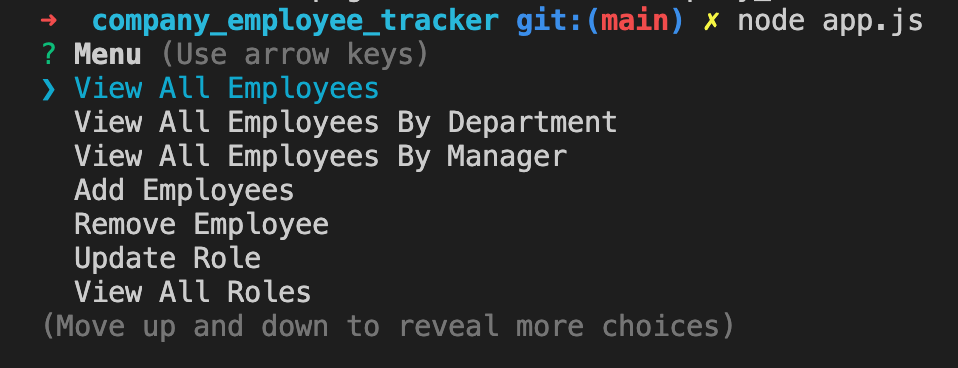
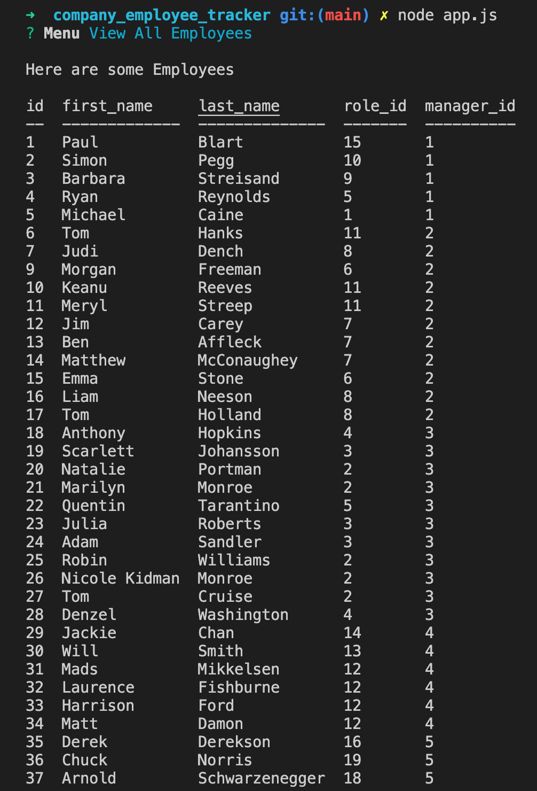

# Employee Database

## Table of Contents

* **[Description](#Description)**

* **[Installation](#Installation)**

* **[Constributions](#Contributions)**

* **[Testing](#Testing)**

* **[Screenshots](#Screenshots)**

* **[Questions](#Questions)**

### Description

A basic Node.js application to view, add and remove employee's and assign them into different roles or to managers. Using inquirer as it's main functionality and mysql database to store, retrieve and manipulate data. Run "node app.js" in the directory to start the application.

### Installation

Copy the application onto your local machine and on the command line, run npm install inquirer, npm install mysql and npm install console.table.

### Constributions

NONE

### Testing

NONE

### Screenshots

### Questions

**Any questions please contact me either [here](https://github.com/tallglassof-milkjake) or at jrmackinlay90@gmail.com
